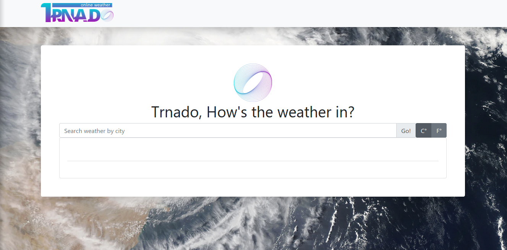
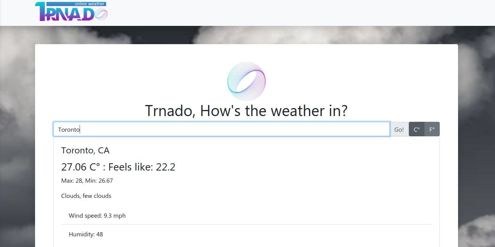
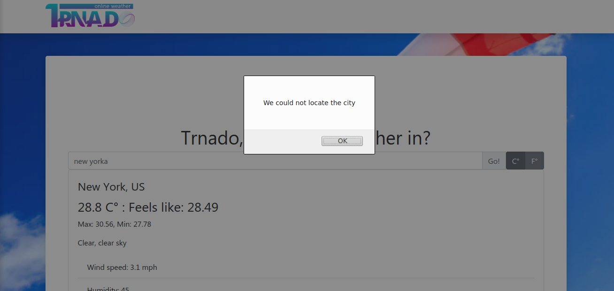

> Updated Version 1.1
 

 

 <h3 align="center">Trnado: Weather application in JavaScript using Webpack</h3>

 

   A full JavaScript webpack generated app for weather forecast using Bootstrap and module programming
    
   <a href="https://www.theodinproject.com/courses/javascript/lessons/weather-app"><strong> Project Specs »</strong></a>
    
    
 

<!-- TABLE OF CONTENTS -->
## Table of Contents

* [About the Project](#about-the-project)
* [Live Demo](#live-demo)
* [How to run](#how-to-run)
* [Features](#features)
* [Screenshots](#screenshots)
* [Built With](#built-with)
* [Contact](#contact)

## About The Project

this app uses OpenWeather API to fetch weather forecast for several cities around the globe, the minimal UI allows quick and easy navigability and accesibility.

## Live Demo

* [Trnado](https://raw.githack.com/Usagib/js-weather/03-datafetch/dist/index.html)

### How to run

- Prerequisites

You can acess the live demo or:

- Fork or clone this repository
- run > npm install
- run > npm run build
- run > npm run start
- access your localhost on your browser

### Features

* User can search for city or city and country code
* Temperature and weather forecast is shown
* background image changes according search result

### Screenshots
Home

Result

Not found

## Built With
Project built in Ruby on Rails
* CSS3
* ES6
* [Webpack](https://webpack.js.org/)

Additional packages used
* Bootstrap v4.0
* [file-loader](https://webpack.js.org/loaders/file-loader/)
* [style-loader](https://webpack.js.org/loaders/style-loader/)
* [css-loader](https://webpack.js.org/loaders/css-loader/)
* [webpack](https://webpack.js.org/)

API used
* [OpenWeatherMAp](https://openweathermap.org)
## Contact

Eduardo Bonilla Github [https://github.com/UsagiB](https://github.com/UsagiB)
Eduardo Bonilla Portfolio [Usagib.github.io](http://usagib.github.io)

## Show your support

Give a ⭐️ if you like this project!
